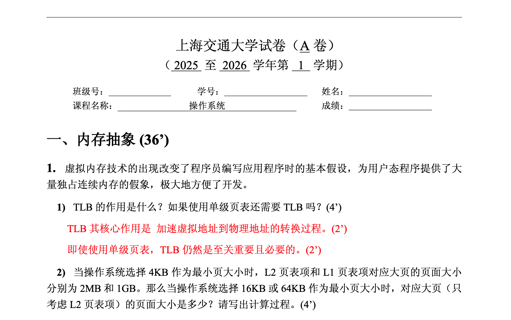
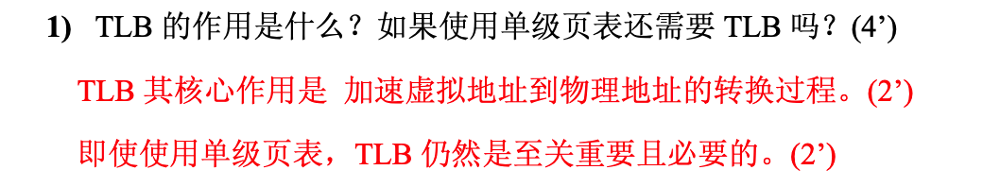
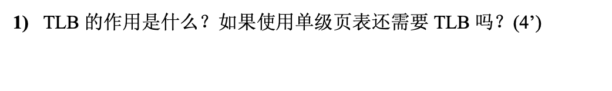

# SJTU 非官方试卷模板



## 构建

使用如下命令构建 PDF：

``` shell
make
```

使用如下命令清理构建产物：

``` shell
make clean
make depclean
```

## 依赖

依赖主要为字体：

- Times New Roman
- Consolas
- SimSun
- SimSun
- KaiTi

## 特性

### 中英文支持

基于 `ctex` ，混合使用中英文各种样式无压力。

### 自动更新卷头和页数

本模板会在编译时自动获取时间并更新卷头，再也不用担心写错年份和学期了。

### Answer 条件编译

本模板允许答案的条件编译，有答案版本和无答案版本的试卷可以由同一个文件生成。

有答案版本：



无答案版本：




### 核算分数脚本

分数调整经常会导致一个大题的总分数与各小题分数对应不上，或者卷面整体分数与各个大题分数对应不上。本项目带有一个核分脚本，可以用于检测分数是否正确。

使用如下命令：

``` shell
make check
```

如果得到如下输出，则说明存在问题：

``` shell
内存抽象 has score 36 , which should be 34
Total score is 98
```

## 使用

### 卷头设置

可以在 `main.tex` 中找到如下代码，修改代码即可修改卷头（学年和学期默认为自动计算，也可以手动设置）：

``` latex
% exam info
\newcommand{\school}{上海交通大学}
\newcommand{\papertype}{A}
\newcommand{\startyear}{\the\year}
\newcommand{\nextyear}{\the\numexpr\startyear+1\relax}
\newcommand{\semester}{\currentsemester}
\newcommand{\coursename}{操作系统}
```

### 层次结构

本模板使用 `section, subsection, subsubsection` 作为试卷题目层次结构的命令。其中 `subsection, subsubsection` 默认不换行。对于没有标题的小节，空置即可。

### 答案

答案需要使用新环境 `answer` ，如下所示：

``` latex
\begin{answer}
  TLB 其核心作用是​​加速虚拟地址到物理地址的转换过程。 \score{2}

  即使使用单级页表， TLB 仍然是至关重要且必要的。 \score{2}
\end{answer}
```

如果希望答案显示，可在模板中找到如下代码：

``` latex
% show answer or not
\newif\ifshowans
\showanstrue
% \showansfalse
```

如果希望答案隐藏，可在模板中找到如下代码：

``` latex
% show answer or not
\newif\ifshowans
% \showanstrue
\showansfalse
```

本质是控制变量 `showans` 的 `true` or `false` 。

### 分数

本模板引入了新命令 `\score{x}` ，它会生成 `(x')` 的文本。我强烈建议使用这个命令，因为纯手搓，很容易出现半角与全角符号混用的情况。

此外使用此命令，还可以使用本项目提供的分数核验功能。分数核验脚本会在 `main.tex` 中捕获 `\score(x)` 文本。更具体而言，脚本会先捕获 section 的 score，其形式如下：

``` latex
\section{内存抽象 \score{36}}
```

然后捕获每个 section 内其他 score （会忽略 `answer` 环境内的 score ），形式如下：

``` latex
TLB 的作用是什么？如果使用单级页表还需要 TLB 吗？\score{4}
```

最终核验这两个部分是否相等。